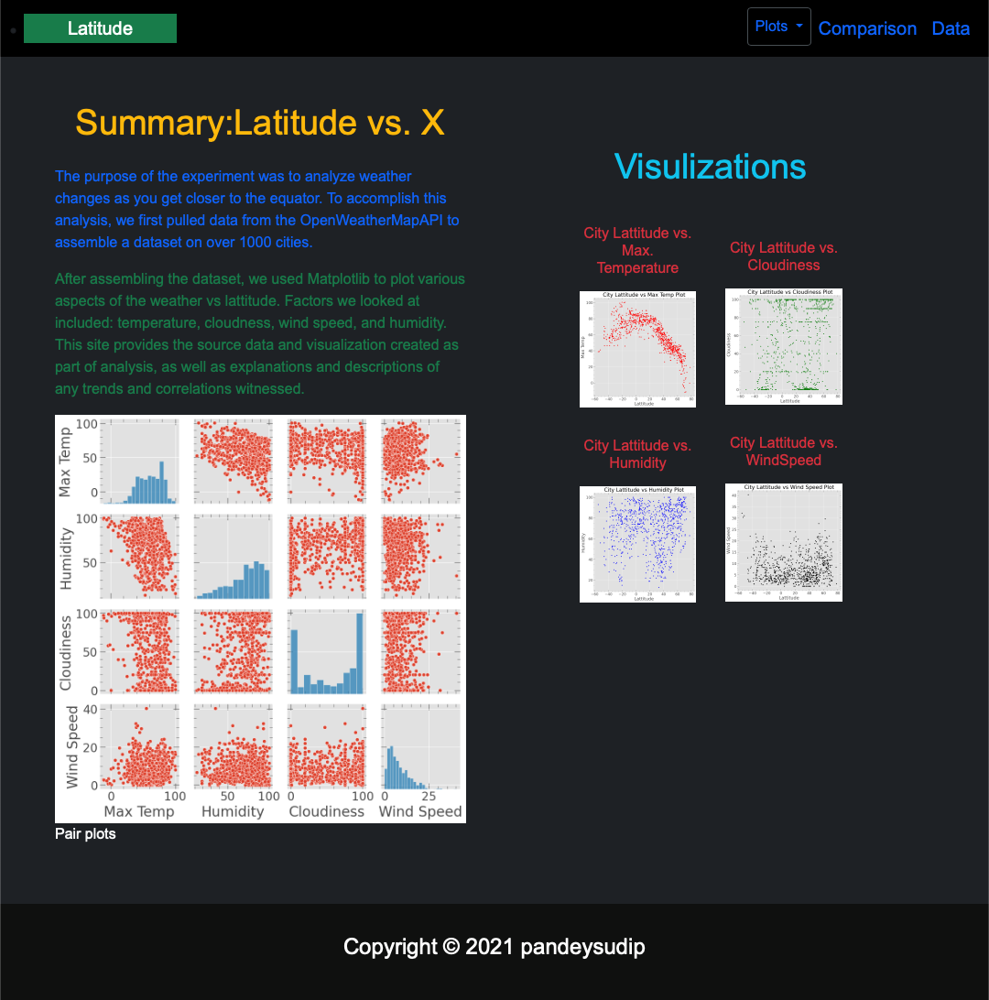
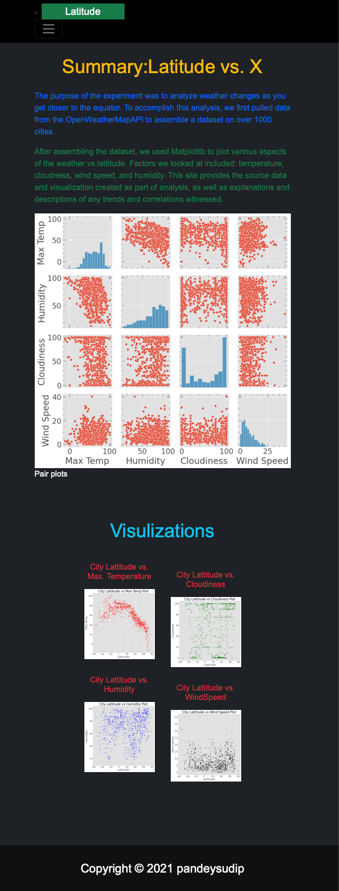
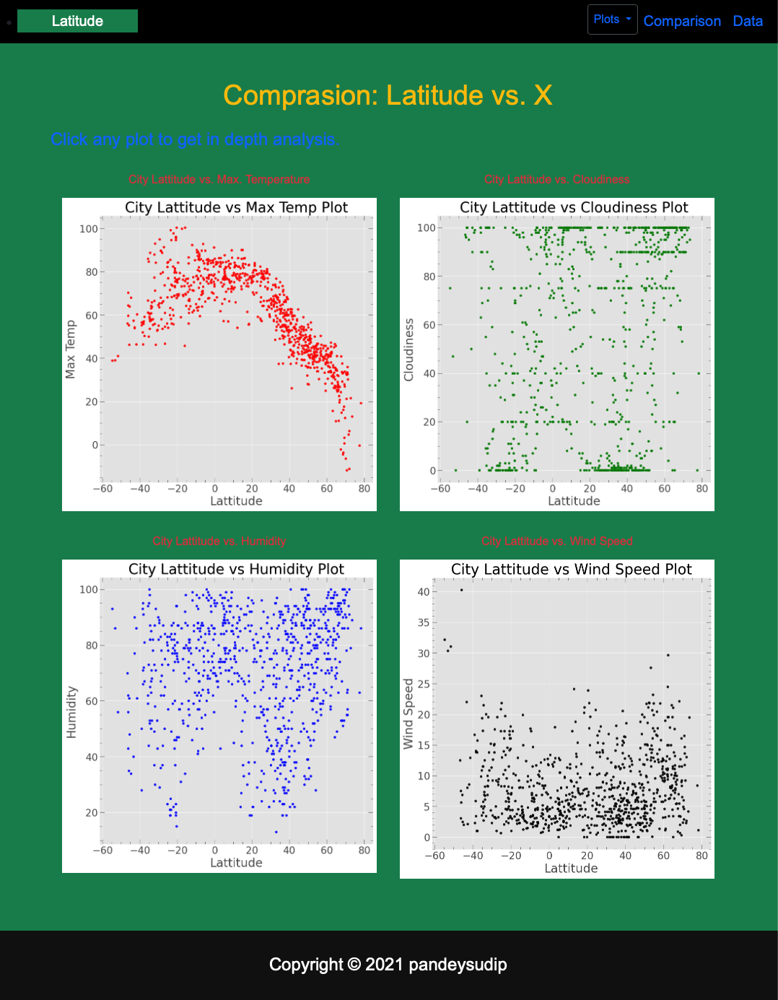
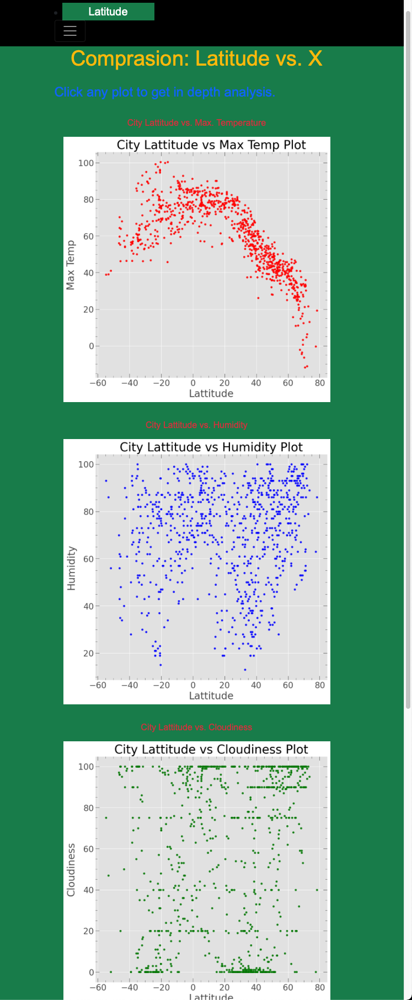
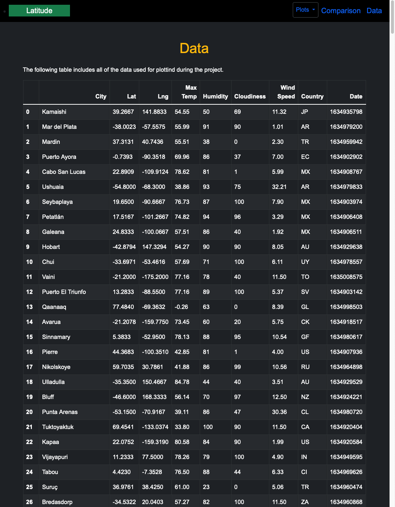
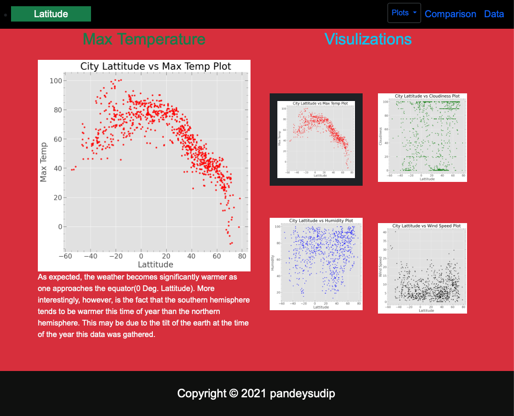
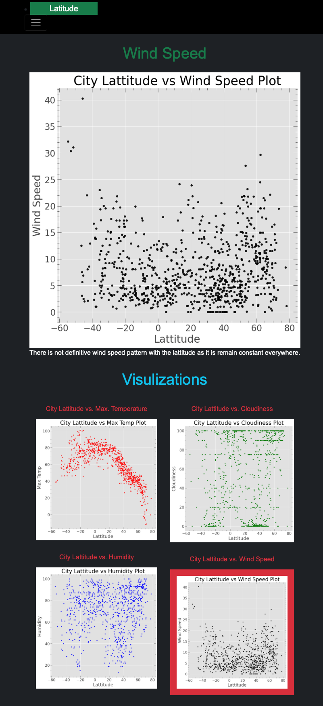
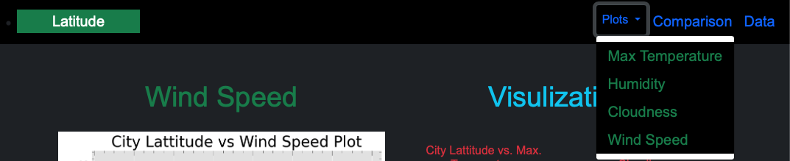
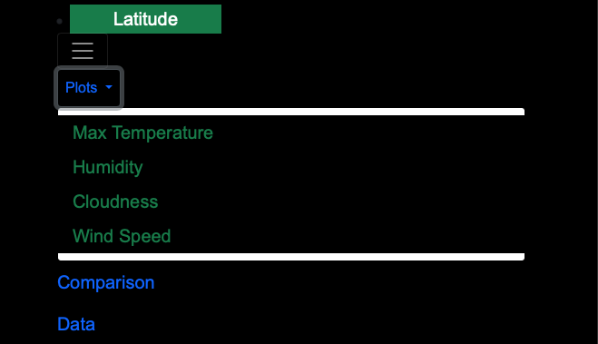

# web-design-challenge Web Visualization Dashboard 

## Background

Creating a dashboard using HTML, CSS, and Bootstrap.

The website is deployed to GitHub at:  
https://pandeysudip.github.io/web-design-challenge/ 

## Latitude - Latitude Analysis Dashboard with Attitude

I have created a visualization dashboard website for the weather data [weather data](Resources/cities.csv).

In building this dashboard, I have created individual pages for each plot and a means by which we can navigate between them. These pages contained the visualizations and their corresponding explanations. There is a:

* A [landing page](#landing-page) containing:
  * An explanation of the project.
  * Links to each visualizations page. There should be a sidebar containing preview images of each plot, and clicking an image should take the user to that visualization.
* Four [visualization pages](#visualization-pages), each with:
  * A descriptive title and heading tag.
  * The plot/visualization itself for the selected comparison.
  * A paragraph describing the plot and its significance.
* A ["Comparisons" page](#comparisons-page) that:
  * Contains all of the visualizations on the same page so we can easily visually compare them.
  * Uses a Bootstrap grid for the visualizations.
    * The grid must be two visualizations across on screens medium and larger, and 1 across on extra-small and small screens.
* A ["Data" page](#data-page) that:
  * Displays a responsive table containing the data used in the visualizations.
    

The website also have a navigation menu that:

* Show the name of the site on the left of the nav which allows users to return to the landing page from any page.
* Contains a dropdown menu on the right of the navbar named "Plots" that provides a link to each individual visualization page.
* Provides two more text links on the right: "Comparisons," which links to the comparisons page, and "Data," which links to the data page.
* Is responsive (using media queries). The nav  have similar behavior as the screenshots ["Navigation Menu" section](#navigation-menu).

### Screenshots

This section contains screenshots of each page:

#### Landing page

Large screen:

Small screen:

#### Comparisons page

Large screen:

Small screen:

#### Data page

Large screen:

#### Visualization pages

You'll build four of these, one for each visualization. Here's an example of one:

Large screen:

Small screen:

#### Navigation menu

Large screen:

Small screen:

